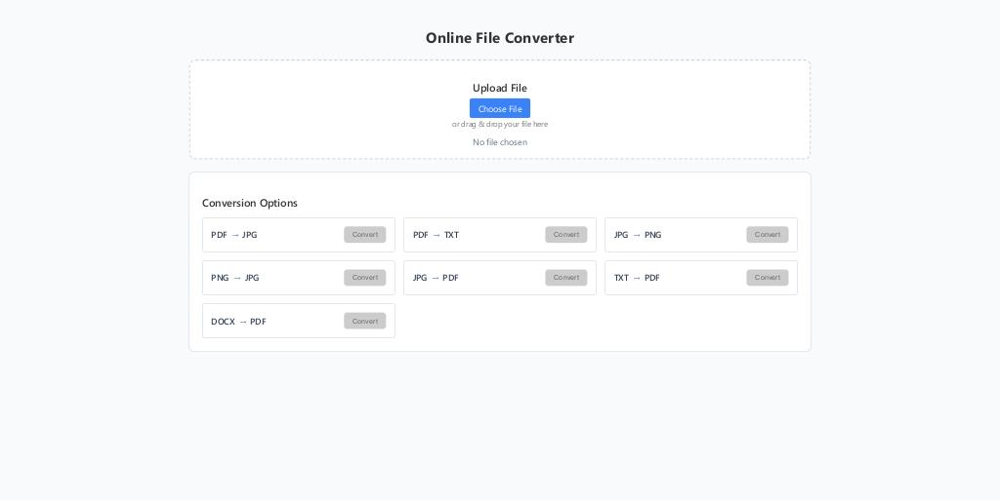
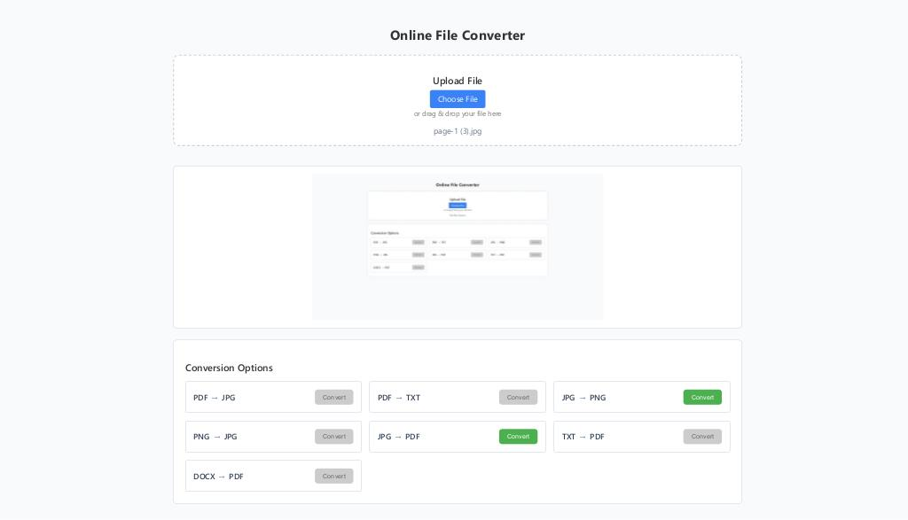

# 🔄 Online File Converter-app

**Online File Converter-app** is a modern full-stack web application for converting files between popular formats — **PDF**, **DOCX**, **TXT**, **JPG**, **PNG**, and more.  
It’s designed as a **secure alternative to public online converters**, since it can be **run entirely locally**, without uploading any files to external servers.

---

## 🧩 Project Overview

The project consists of two main parts:

- 🖥️ **Frontend:** React + Vite + TypeScript  
  - A clean, lightweight, and fully responsive interface built with functional components.  
  - After uploading a file, the app **automatically enables only valid conversion options** based on the detected format.  
  - Offers **two live previews** — one for the source file and one for the converted output.

- ⚙️ **Backend:** Node.js + TypeScript  
  - Strict validation of uploaded files: checks **both real MIME types** and **file extensions**.  
  - Automatic cleanup of temporary files in `uploads/` and `output/` directories:
    - on **server startup**  
    - on **server shutdown**  
    - and **periodically** after conversions.  
  - Ensures the app remains lightweight, private, and secure — with no residual sensitive data.

---

## ⚡ Running the Application

The entire stack (frontend + backend) can be launched with a **single command** using the `concurrently` package:

```json
{
  "scripts": {
    "dev": "concurrently \"npm run dev --prefix client\" \"npm run dev --prefix server\""
  }
}
```

Run locally:

```bash
npm run dev
```

Both the `client` and `server` will start simultaneously.

---

## 🔐 Why Run Locally?

Unlike most online converters, **Online File Converter-app** keeps all processing local:

- No data sent to external servers  
- Full control over your files  
- No risk of leaks or unauthorized access

> **Online File Converter-app** — a secure, private, and extensible file conversion tool you can run anywhere.

---

## 📦 Key Features

### ✅ Supported File Conversions

| Category        | Supported Conversions                      |
|-----------------|---------------------------------------------|
| 📄 **PDF**      | PDF ➜ JPG, PDF ➜ TXT                        |
| 🖼️ **Images**   | JPG ➜ PNG, PNG ➜ JPG, JPG ➜ PDF             |
| 📝 **Text**     | TXT ➜ PDF                                   |
| 🧾 **Word**     | DOCX ➜ PDF                                  |

---

### 🧠 Smart Conversion Logic
- Conversion buttons activate **only for compatible output formats** after upload.  
- Prevents invalid or unsupported conversions.

### 👀 Dual Preview System
- **Input preview:** displays the uploaded file.  
- **Output preview:** shows the converted file instantly after processing.

### 🛡️ Advanced File Validation
- Validates both **extension** and **MIME type**.  
- Blocks double extensions or spoofed file types.  
- Ensures safe, verified file handling.

### 🧼 Automatic Cleanup
- Temporary files are deleted:
  - on **startup**, **shutdown**, and **periodically**.  
- Keeps your environment clean and secure.

### 💡 Modern Tech Stack
- **Frontend:** React + Vite + TypeScript  
- **Backend:** Node.js + Express + TypeScript  
- Unified dev environment — run everything with one command.

### ⚡ Designed for Simplicity
- Clear client/server separation  
- Lightweight, modular codebase  
- Easy to extend with new formats and conversion logic

---

## 🛠️ Technologies Used

### **⚙️ Root Configuration**
| Package | Version | Description |
|----------|----------|-------------|
| **concurrently** | ^9.2.0 | Runs multiple npm scripts in parallel (client + server) |
| **file-type** | ^15.0.1 | Detects MIME types from binary signatures |

---

### **🖥️ Client (Frontend)**
React + Vite + TypeScript stack for building a modern, fast user interface.

| Package | Version | Description |
|----------|----------|-------------|
| **react** | ^19.1.1 | Core React library for building UI components |
| **react-dom** | ^19.1.0 | React DOM bindings for rendering components to the browser |
| **vite** | ^6.3.5 | Next-generation build tool and dev server |
| **@vitejs/plugin-react** | ^4.4.1 | React plugin for Vite supporting fast refresh and JSX |
| **typescript** | ~5.8.3 | Typed JavaScript for improved reliability |
| **eslint** | ^9.25.0 | Linter to enforce consistent code style |
| **@eslint/js** | ^9.25.0 | Core ESLint ruleset for JavaScript |
| **typescript-eslint** | ^8.30.1 | TypeScript plugin + parser for ESLint |
| **eslint-plugin-react-hooks** | ^5.2.0 | Enforces React Hooks rules |
| **eslint-plugin-react-refresh** | ^0.4.19 | Integrates React Fast Refresh with ESLint |
| **globals** | ^16.0.0 | Provides a list of global variables for ESLint |
| **@types/react** | ^19.1.2 | Type definitions for React |
| **@types/react-dom** | ^19.1.2 | Type definitions for React DOM |

#### **Client Scripts**
- `npm run dev` → start Vite dev server  
- `npm run build` → build production version  
- `npm run preview` → preview production build  
- `npm run lint` → run ESLint  

---

### **🧠 Server (Backend)**
Express + TypeScript backend handling file uploads, conversions, and PDF/image processing.

| Package | Version | Description |
|----------|----------|-------------|
| **express** | ^4.18.2 | Minimal and flexible web framework for Node.js |
| **cors** | ^2.8.5 | Middleware for enabling Cross-Origin Resource Sharing |
| **multer** | 1.4.5-lts.1 | Middleware for handling file uploads (multipart/form-data) |
| **file-type** | ^16.5.4 | Detects file MIME type and extension |
| **pdf-parse** | ^1.1.1 | Extracts text and metadata from PDF files |
| **pdf-poppler** | ^0.2.1 | Converts PDFs to images (uses Poppler utilities) |
| **pdfkit** | ^0.13.0 | Creates and manipulates PDF files programmatically |
| **sharp** | ^0.33.3 | High-performance image processing library |

#### **Server Dev Dependencies**
| Package | Version | Description |
|----------|----------|-------------|
| **typescript** | ^5.2.2 | Adds static typing to JavaScript |
| **ts-node-dev** | ^2.0.0 | Automatically restarts server when TypeScript files change |
| **@types/node** | ^24.2.1 | Type definitions for Node.js |
| **@types/express** | ^5.0.3 | Type definitions for Express |
| **@types/cors** | ^2.8.19 | Type definitions for CORS |
| **@types/multer** | ^2.0.0 | Type definitions for Multer |
| **@types/pdf-parse** | ^1.1.5 | Type definitions for pdf-parse |
| **@types/pdfkit** | ^0.17.2 | Type definitions for pdfkit |

#### **Server Scripts**
- `npm run dev` → runs backend using `ts-node-dev` with live reload

---

### **🧩 Summary**

| Layer | Stack | Highlights |
|--------|--------|------------|
| **Frontend** | React 19, Vite, TypeScript | Fast, modular UI |
| **Backend** | Express, TypeScript | Handles uploads & conversions securely |
| **Root Tools** | Concurrently, File-Type | Unified dev setup for client & server |

---

## 📁 Project Structure

```
OnlineFileConverter/
├── client/
│   ├── node_modules/
│   ├── public/
│   │   └── favicon.png
│   │
│   ├── src/
│   │   │
│   │   ├── components/
│   │   │   ├── previews/
│   │   │   │   ├── ImagePreview.tsx
│   │   │   │   ├── PDFPreview.tsx
│   │   │   │   ├── TextPreview.tsx
│   │   │   │   ├── UnsupportedPreview.tsx
│   │   │   │   └── WordPreview.tsx
│   │   │   │
│   │   │   ├── ConversionOptions.tsx
│   │   │   ├── DownloadSection.tsx
│   │   │   ├── FileConverter.tsx
│   │   │   └── FileUpload.tsx
│   │   │
│   │   ├── styles/
│   │   │   └── FileConverter.css
│   │   │
│   │   ├── types/
│   │   │   └── converter.ts
│   │   │
│   │   ├── utils/
│   │   │   ├── allowedConversions.ts
│   │   │   └── fileUtils.ts
│   │   │
│   │   ├── App.css
│   │   ├── App.tsx
│   │   ├── index.css
│   │   ├── main.tsx
│   │   └── vite-env.d.ts
│   │
│   ├── .gitignore
│   ├── eslint.config.js
│   ├── index.html
│   ├── package.json
│   ├── package-lock.json
│   ├── tsconfig.app.json
│   ├── tsconfig.json
│   ├── tsconfig.node.json
│   └── vite.config.ts
│
├── server/
│   ├── src/
│   │   ├── controllers/
│   │   │   ├── docController.ts
│   │   │   ├── imageController.ts
│   │   │   └── pdfController.ts
│   │   │
│   │   ├── middlewares/
│   │   │   ├── fileValidation.ts
│   │   │   ├── routeDispatcher.ts
│   │   │   └── upload.ts
│   │   │
│   │   ├── routes/
│   │   │   ├── doc.routes.ts
│   │   │   ├── image.routes.ts
│   │   │   └── pdf.routes.ts
│   │   │
│   │   ├── utils/
│   │   │   ├── constants.ts
│   │   │   ├── file.ts
│   │   │   └── sourceValidation.ts
│   │   │
│   │   ├── types/
│   │   │   └── pdf-poppler.d.ts
│   │   │
│   │   ├── app.ts
│   │   └── server.ts
│   │
│   ├── uploads/
│   │   └── (temporary uploaded files)
│   │
│   ├── .gitignore
│   ├── package.json
│   ├── package-lock.json
│   └── tsconfig.json
│
├── node_modules/
├── screenshots/
│
├── .gitignore
├── package-lock.json
├── package.json
└── README.md

---
```

## 🚀 Local Setup

1. **Clone the repo**
```bash
git clone https://github.com/Jaroslaw-Baumgart/OnlineConverter-app
cd OnlineConverter
```

2. **Install dependencies**
```bash
npm install
cd client && npm install && cd ..
cd server && npm install && cd ..
```

3. **Install required tools**

**Ubuntu / Debian**
```bash
sudo apt install libreoffice unoconv poppler-utils
```

**macOS**
```bash
brew install --cask libreoffice
brew install poppler unoconv
```

**Windows**
- [LibreOffice](https://www.libreoffice.org/download/download/) → Add to PATH  
- [Poppler](https://github.com/oschwartz10612/poppler-windows/releases) → Add `C:\poppler\bin` to PATH

4. **Run the app**
```bash
npm run dev
```
- Frontend: [http://localhost:5173](http://localhost:5173)  
- Backend: [http://localhost:5000](http://localhost:5000)

---

## 📷 Screenshots

| Interface States | Preview |
|------------------|---------|
| Main Page |  |
| File Selected |  |
| Conversion Result |  |

---

## 🔮 Future Plans

| Area | Planned Features | Description |
|------|------------------|-------------|
| 🧩 **File Support Expansion** | Add support for more formats | Support for **CSV**, **XLSX**, **HTML**, and **Markdown** conversions. |
| ☁️ **Optional Cloud Mode** | Add secure cloud execution | Allow users to connect optional S3 or Azure Blob storage for processing large files remotely. |
| 🧠 **AI-based Enhancements** | Integrate intelligent file detection | Use lightweight AI to auto-detect content type (e.g., scanned PDF vs. text PDF). |
| 🖼️ **Batch Conversion** | Convert multiple files at once | Enable drag-and-drop for folders and bulk export. |
| ⚙️ **Configurable Output Settings** | User customization | Let users adjust resolution, compression, PDF quality, and font embedding. |
| 🎨 **UI/UX Enhancements** | Improved interface and dark mode | Add light/dark themes, progress bars, and better file preview scaling. |
| 🔒 **Security Layer Improvements** | Strengthen file validation | Implement optional checksum verification and sandboxing for unknown formats. |
| 🧰 **Packaging** | Desktop build (Electron) | Allow running the app as a native desktop converter. |
| 🧾 **Documentation & Testing** | Expand test coverage | Add integration tests (Jest + Supertest) and CI pipeline with GitHub Actions. |

---

## 📬 Contact

- **GitHub:** [Jaroslaw-Baumgart](https://github.com/Jaroslaw-Baumgart)  
- **Email:** [jaroslawbaumgart@gmail.com](mailto:jaroslawbaumgart@gmail.com)

